# ggrastr

## Rasterizing ggplot objects with `rasterize`

When you need to plot data with many observations, storing plots
completely in vector format is unsuitable: it requires tons of space and
is very slow to work with in graphic editors. On the other hand,
completely rasterizing the plot distorts important text content and
prevents readers from editing and copying. The solution provided here
within the package `ggrastr` is to rasterize layers that have a lot of
data points, keeping all the rest in vector format.

The simplest way to rasterize some of your layers is to call `rasterize`
on the plot object:

    library(ggplot2)
    library(ggrastr)

    plot <- ggplot(diamonds, aes(carat, price, colour = cut)) +
      geom_point()

    rasterize(plot, layers='Point', dpi=50)

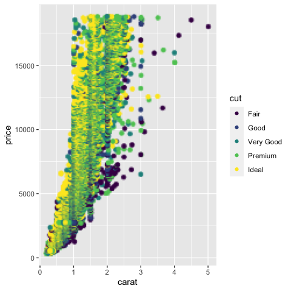

The layer parameter here accepts the layers, which should be rasterized
and can work with vectors of layer types.

## Rasterizing individual layers

The same function can be applied on the level of individual layers. It
allows users to rasterize only some layers of the same type:

    ggplot() + 
      rasterise(geom_point(aes(carat, price, colour = cut), data=diamonds), dpi=30) +
      geom_point(aes(x=runif(20, 0, 5), y=runif(20, 0, 20000)), size=10, color="black", shape=8)

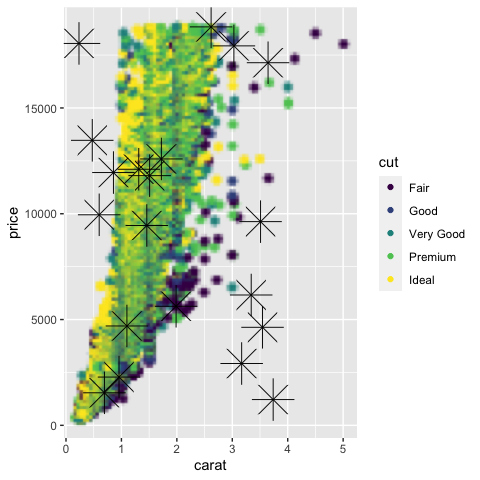

Note that when the aspect ratio is distorted, the objects are rendered
without distortion, i.e. the points in this example are still circles:

    # Points remain round across different aspect ratios
    plot <- ggplot(diamonds, aes(carat, price, colour = cut))
    plot + rasterise(geom_point(), dpi = 72) + theme(aspect.ratio = 0.2)

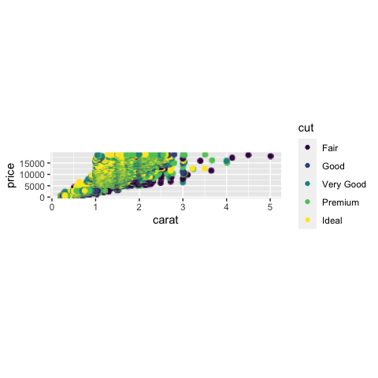

## Advanced options

### Selecting rendering device

By default, plots are rendered with
[Cairo](https://CRAN.R-project.org/package=Cairo). However, users now
have the option to render plots with the
[ragg](https://github.com/r-lib/ragg) device. The motivation for using
`ragg` is that `ragg` can be faster and has better anti-aliasing. That
being said, the default ragg device also has some alpha blending quirks.
Because of these quirks, users are recommended to use the `ragg_png`
option to work around the alpha blending.

The differences in devices are best seen at lower resolution:

    # The default 'cairo' at dpi=5
    plot + rasterise(geom_point(), dpi = 5, dev = "cairo")

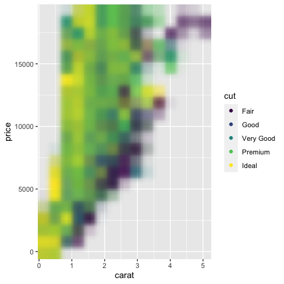

    # Using 'ragg' gives better anti-aliasing but has unexpected alpha blending
    plot + rasterise(geom_point(), dpi = 5, dev = "ragg")

    # Using 'ragg_png' solves the alpha blend, but requires writing a temporary file to disk
    plot + rasterise(geom_point(), dpi = 5, dev = "ragg_png")

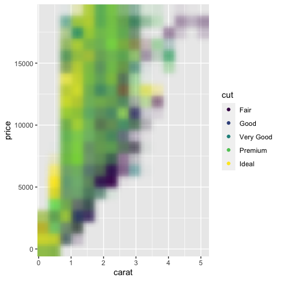

Note that facets are rendered correctly without users having to adjust
the width/height settings.

    # Facets will not warp/distort points
    set.seed(123)
    plot + rasterise(geom_point(), dpi = 300) + facet_wrap(~ sample(1:3, nrow(diamonds), 2))

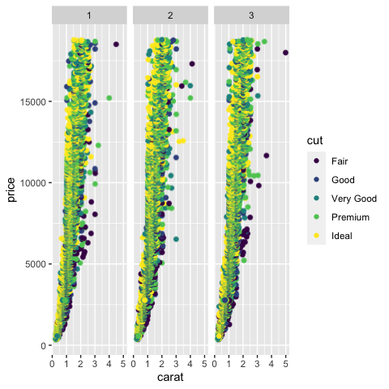

### Scaling size of raster objects

Users are also able to change the size of the raster objects with the
parameter `scale`. The default behavior is not to modify the size with
`scale=1`:

    # unchanged scaling, scale=1
    plot <- ggplot(diamonds, aes(carat, price, colour = cut))
    plot + rasterise(geom_point(), dpi = 300, scale = 1)

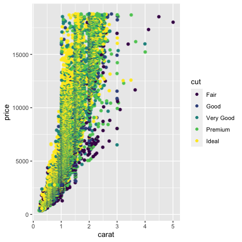

Setting `scale` to values greater than 1 will increase the size of the
rasterized objects. In this case, `scale=2` will double the size of the
points in comparison to the original plot:

    # larger objects, scale > 1
    plot <- ggplot(diamonds, aes(carat, price, colour = cut))
    plot + rasterise(geom_point(), dpi = 300, scale = 2)

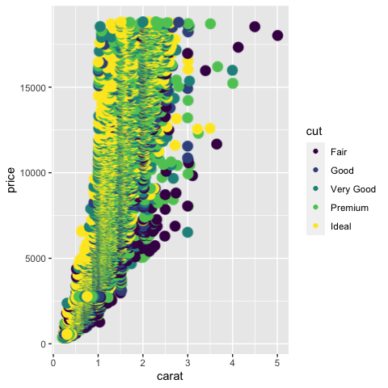

Similarly, values less than 1 will result in smaller objects. Here we
see `scale=0.5` results in points half the size of the points in the
original plot above:

    # smaller objects, scale < 1
    plot <- ggplot(diamonds, aes(carat, price, colour = cut))
    plot + rasterise(geom_point(), dpi = 300, scale = 0.5)

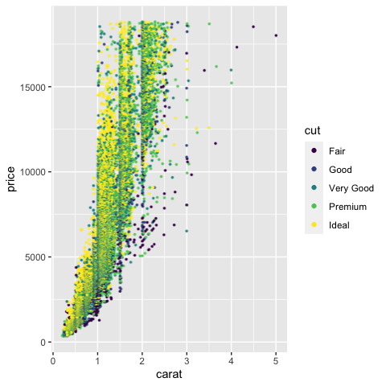

### Rasterize multiple layers with lists

As of ggrastr versions `>=0.2.3`, users are also able to rasterize
multiple layers at once using (valid) lists. It is mainly useful when
working with `geom_sf`, as it returns the list object instead of a
single geom:

    world1 <- sf::st_as_sf(maps::map('world', plot = FALSE, fill = TRUE))
    ggplot() + rasterise(
      list(
        list(
          geom_sf(data = world1),
          theme(panel.background = element_rect(fill = "skyblue"))
        ),
        list(
          list(
            geom_point(aes(x = rnorm(100, sd = 10), y = rnorm(100, sd = 10)))
          ),
          theme(panel.border = element_rect(fill = NA, colour = "blue"))
        )
      )
    )

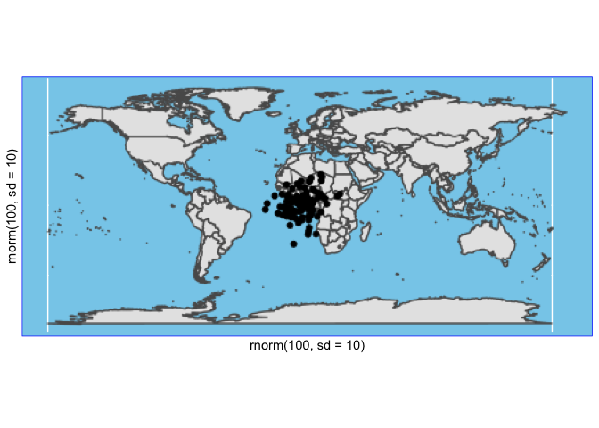

### Set the parameter ‘dpi’ globally with options(ggrastr.default.dpi=N)

The parameter `dpi` is an integer which sets the desired resolution in
dots per inch. With ggrastr versions `>=0.2.2`, users can set this
parameter globally, using
[options()](https://stat.ethz.ch/R-manual/R-devel/library/base/html/options.html).
In the following example, plots will be rendered with `dpi=750` after
the user sets this with `options(ggrastr.default.dpi=750)`:

    ## set ggrastr.default.dpi with options()
    options(ggrastr.default.dpi=750)

    plot <- ggplot(diamonds, aes(carat, price, colour = cut))
    new_plot = plot + rasterise(geom_point()) + theme(aspect.ratio = 1)
    print(new_plot)

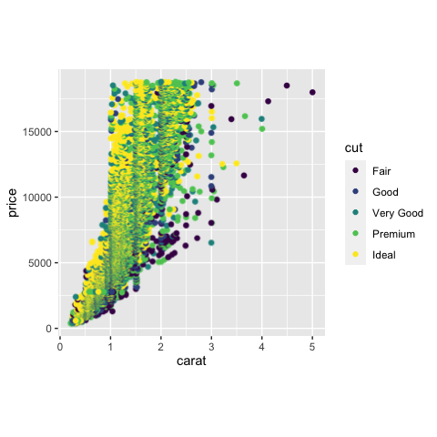

    ## set back to default 300
    options(ggrastr.default.dpi=300)

## Other wrapper functions

For legacy reasons, we have all popular geoms wrapped inside the
package. However, we strongly encourage users to use the `rasterise()`
function instead.

-   `geom_point_rast`: raster scatter plots
-   `geom_jitter_rast`: raster jittered scatter plots
-   `geom_boxplot_jitter`: boxplots that allows to jitter and rasterize
    outlier points
-   `geom_tile_rast`: raster heatmap
-   `geom_beeswarm_rast`: raster [bee swarm
    plots](https://github.com/eclarke/ggbeeswarm#geom_beeswarm)
-   `geom_quasirandom_rast`: raster [quasirandom scatter
    plot](https://github.com/eclarke/ggbeeswarm#geom_quasirandom)

For more details, see the vignettes detailing these legacy functions
[here](https://github.com/VPetukhov/ggrastr/blob/main/vignettes/Legacy_functions.md)
(for the Markdown version) and
[here](https://htmlpreview.github.io/?https://raw.githubusercontent.com/VPetukhov/ggrastr/main/doc/Legacy_functions.html)
(for the HTML version).
