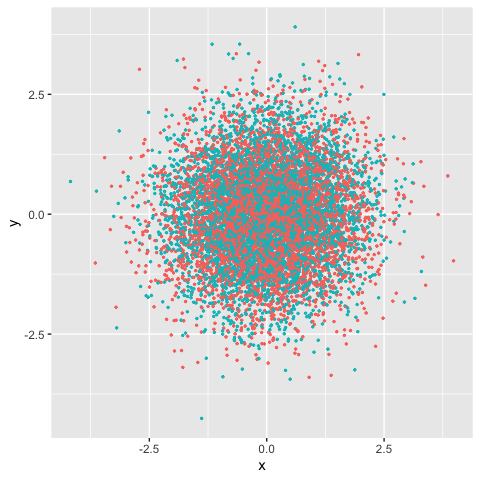
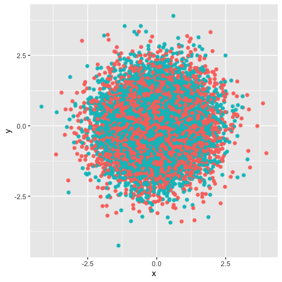
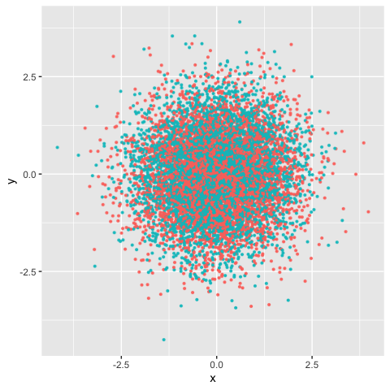
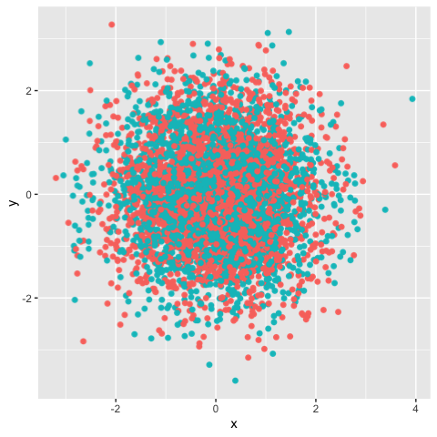
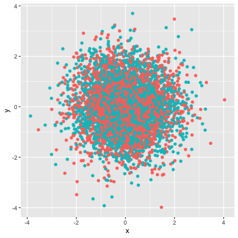
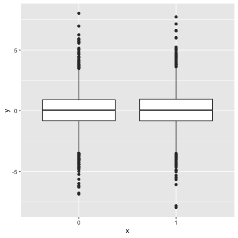
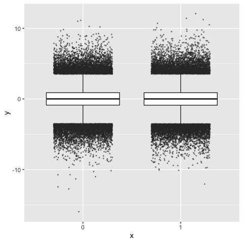

# Legacy (outdated) wrapper functions

For historic reasons, `ggrastr` used to be solely composed of the
following functions:

-   `geom_point_rast`: raster scatter plots
-   `geom_jitter_rast`: raster jittered scatter plots
-   `geom_boxplot_jitter`: boxplots that allows to jitter and rasterize
    outlier points
-   `geom_tile_rast`: raster heatmap
-   `geom_beeswarm_rast`: raster [bee swarm
    plots](https://github.com/eclarke/ggbeeswarm#geom_beeswarm)
-   `geom_quasirandom_rast`: raster [quasirandom scatter
    plot](https://github.com/eclarke/ggbeeswarm#geom_quasirandom)

However, we strongly encourage users to use the `rasterise()` function
instead. For posterity’s sake, we have only included the old vignettes
here for the reference of users, along with the equivalent functions
using `rasterise()`.

#### Points: Rasterize scatter plots with geom\_point\_rast()

Sometimes you need to publish a figure in a vector format:

    library(ggplot2)
    library(ggrastr)
    points_num <- 10000
    df <- data.frame(x=rnorm(points_num), y=rnorm(points_num), c=as.factor(1:points_num %% 2))
    gg <- ggplot(df, aes(x=x, y=y, color=c)) + scale_color_discrete(guide="none")
    gg_vec <- gg + geom_point(size=0.5)
    print(gg_vec)

But in other cases, your figure contains thousands of points, e.g. try
`points_num <- 500000` in the example above, and you will notice the
performance issues—it takes significantly longer to render the plot.

In this case, a reasonable solution would be to rasterize the plot. But
the problem is that all text becomes rasterized as well.

Raster layers with `ggrastr` were developed to prevent such a situation,
using \`rasterized

    gg_rasterized <- gg + rasterise(geom_point(), dpi = 300, scale = 1)
    print(gg_rasterized)

The legacy function used in older versions of ggrastr was
`geom_point_rast()`:

    gg_rast <- gg + geom_point_rast(size=0.5)
    print(gg_rast)

The plots look the same, but the difference in size can be seen when
they are exported to pdfs. Unfortunately, there is a longer rendering
time to produce such plots:

    PrintFileSize <- function(gg, name) {
      invisible(ggsave('tmp.pdf', gg, width=4, height=4))
      cat(name, ': ', file.info('tmp.pdf')$size / 1024, ' Kb.\n', sep = '')
      unlink('tmp.pdf')
    }
    PrintFileSize(gg_rast, 'Raster')
    #> Raster: 274.4658 Kb.
    PrintFileSize(gg_vec, 'Vector')
    #> Vector: 555.8945 Kb.

As expected, the difference becomes larger with growth of number of
points:

    points_num <- 1000000
    df <- data.frame(x=rnorm(points_num), y=rnorm(points_num), c=as.factor(1:points_num %% 2))
    gg <- ggplot(df, aes(x=x, y=y, color=c)) + scale_color_discrete(guide="none")
    gg_vec <- gg + geom_point(size=0.5)
    gg_rast <- gg + geom_point_rast(size=0.5)
    PrintFileSize(gg_rast, 'Raster')
    #> Raster: 378.667 Kb.
    PrintFileSize(gg_vec, 'Vector')
    #> Vector: 54878.79 Kb.

#### Jitter: Rasterize jittered scatter plots with geom\_jitter\_rast()

Users may also opt to create rasterized scatter plots with jitter:

    library(ggplot2)
    library(ggrastr)
    points_num <- 5000 
    df <- data.frame(x=rnorm(points_num), y=rnorm(points_num), c=as.factor(1:points_num %% 2))
    gg <- ggplot(df, aes(x=x, y=y, color=c)) + scale_color_discrete(guide="none")
    gg_jitter_rast <- gg + rasterise(geom_jitter(), dpi = 300, scale = 1)
    print(gg_jitter_rast)

The legacy wrapper `geom_jitter_rast()` used the following syntax:

    library(ggplot2)
    library(ggrastr)

    points_num <- 5000 
    df <- data.frame(x=rnorm(points_num), y=rnorm(points_num), c=as.factor(1:points_num %% 2))
    gg <- ggplot(df, aes(x=x, y=y, color=c)) + scale_color_discrete(guide=FALSE)

    gg_jitter_rast <- gg + geom_jitter_rast(raster.dpi=600)
    print(gg_jitter_rast)
    #> Warning: It is deprecated to specify `guide = FALSE` to remove a guide. Please
    #> use `guide = "none"` instead.

#### Tiles: Rasterize heatmaps with geom\_tile\_rast()

Heatmaps also have similar issues with the default vectorized formats:

    library(ggplot2)
    library(ggrastr)
    coords <- expand.grid(1:500, 1:500)
    coords$Value <- 1 / apply(as.matrix(coords), 1, function(x) sum((x - c(50, 50))^2)^0.01)
    gg_tile_vec <- ggplot(coords) + geom_tile(aes(x=Var1, y=Var2, fill=Value))
    gg_tile_rast <- ggplot(coords) + rasterise(geom_tile(aes(x=Var1, y=Var2, fill=Value)), dpi = 300, scale = 1)
    print(gg_tile_rast)

The legacy function `geom_tile_rast()` used the following syntax:

    gg_tile_rast <- ggplot(coords) + geom_tile_rast(aes(x=Var1, y=Var2, fill=Value))
    print(gg_tile_rast)

Note that we can see that the rasterized plots using `ggrastr` are
lighter in size when rendered to pdf:

    PrintFileSize(gg_tile_rast, 'Raster')
    #> Raster: 46.77637 Kb.
    PrintFileSize(gg_tile_vec, 'Vector')
    #> Vector: 817.8398 Kb.

#### Violin plots: Rasterize violin plots with geom\_violin\_rast()

One can see a similar effect with violin plots:

    library(ggplot2)
    library(ggrastr)
    gg_violin_vec <- ggplot(mtcars, aes(factor(cyl), mpg)) + geom_violin()
    gg_violin_rast <- ggplot(mtcars) + rasterise(geom_violin(aes(factor(cyl), mpg)))
    print(gg_violin_rast)

The legacy function `geom_violin_rast()` had the following syntax:

    gg_violin_rast <- ggplot(mtcars) + geom_violin_rast(aes(factor(cyl), mpg))
    print(gg_violin_rast)

    ## difference in size shown
    PrintFileSize(gg_tile_rast, 'Raster')
    #> Raster: 46.77637 Kb.
    PrintFileSize(gg_tile_vec, 'Vector')
    #> Vector: 817.8398 Kb.

#### Box plots: Jitter outliers and rasterize box plots with geom\_boxplot\_jitter

Another type of plot with a potentially large number of small objects is
geom\_boxplot:

    library(ggplot2)
    library(ggrastr)
    points_num <- 5000
    df <- data.frame(x=as.factor(1:points_num %% 2), y=log(abs(rcauchy(points_num))))
    gg <- ggplot(df, aes(x=x, y=y)) + scale_color_discrete(guide="none")
    boxplot <- gg + geom_boxplot()
    print(boxplot)

With a large number of objects, outlier points become noninformative.
For example, here is the rendered plot with `points_num <- 1000000`.

For such a large number of points, it would be better to jitter them
using `geom_boxplot_jitter()`:

    library(ggplot2)
    library(ggrastr)
    points_num <- 500000
    df <- data.frame(x=as.factor(1:points_num %% 2), y=log(abs(rcauchy(points_num))))
    gg <- ggplot(df, aes(x=x, y=y)) + scale_color_discrete(guide="none")
    gg_box_vec <- gg + geom_boxplot_jitter(outlier.size=0.1, outlier.jitter.width=0.3, outlier.alpha=0.5)
    print(gg_box_vec)

And this geom can be rasterized as well:

    gg_box_rast <- gg + geom_boxplot_jitter(outlier.size=0.1, outlier.jitter.width=0.3, outlier.alpha=0.5, raster.dpi=200)
    print(gg_box_rast)

    PrintFileSize(gg_box_rast, 'Raster')
    #> Raster: 110.1172 Kb.
    PrintFileSize(gg_box_vec, 'Vector')
    #> Vector: 208.2891 Kb.

#### Beeswarm-style plots: geom\_beeswarm\_rast and geom\_quasirandom

ggrastr also allows users to create rasterized beeswarm plots. As
described in the README for
[ggbeeswarm](https://github.com/eclarke/ggbeeswarm),

> Beeswarm plots (aka column scatter plots or violin scatter plots) are
> a way of plotting points that would ordinarily overlap so that they
> fall next to each other instead. In addition to reducing overplotting,
> it helps visualize the density of the data at each point (similar to a
> violin plot), while still showing each data point individually. The
> ggrastr geom `geom_beeswarm_rast` is similar to
> `ggbeeswarm::geom_beeswarm()`, but it provides a rasterized layer:

    library(ggplot2)
    library(ggrastr)
    ggplot(mtcars) + geom_beeswarm_rast(aes(x = factor(cyl), y=mpg), raster.dpi=600, cex=1.5)

Again, we strongly encourage users to simply use `rasterise()`:

    library(ggplot2)
    library(ggrastr)
    library(ggbeeswarm,)
    ggplot(mtcars) + rasterise(geom_beeswarm(aes(x = factor(cyl), y=mpg)))

Analogously, the legacy wrapper `geom_quasirandom_rast()` is much like
`ggbeeswarm::geom_quasirandom()`, but with a rasterized layer:

    library(ggplot2)
    library(ggrastr)
    ggplot(mtcars) + geom_quasirandom_rast(aes(x = factor(cyl), y=mpg), raster.dpi=600)

We encourage users to visit both
[CRAN](https://CRAN.R-project.org/package=ggbeeswarm) and the [GitHub
repo for ggbeeswam](https://github.com/eclarke/ggbeeswarm) for more
details.
