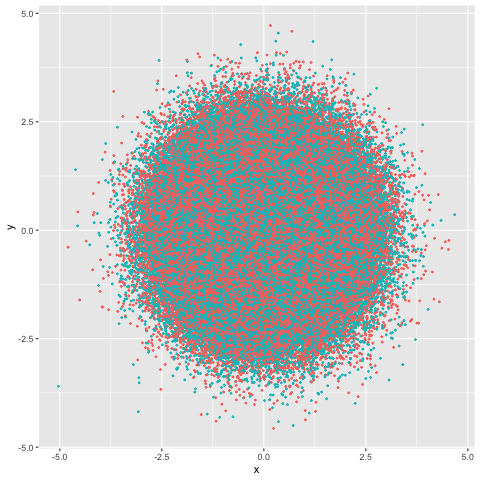
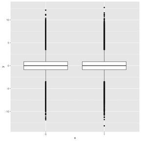

```{r setup, include = FALSE}
knitr::opts_chunk$set(
  collapse = TRUE,
  comment = "#>"
)
```

## ggrastr

### Convert any ggplot2 layer into a rasterized output

Using the function `rasterize()`, users can rasterize any ggplot2 layer:


```{r}
library(ggplot2)
library(ggrastr)

plot <- ggplot(diamonds, aes(carat, price, colour = cut))

plot + rasterise(geom_point(), dpi = 72) + theme(aspect.ratio = 1)
```

Note that with ggrastr changes in version 0.2.0, when the aspect ratio is distorted, points are still rendered without distortion, i.e. the points are still circles:

```{r}
# Points remain round across different aspect ratios
plot + rasterise(geom_point(), dpi = 72) + theme(aspect.ratio = 0.2)
```

By default, plots are rendered with [cairo](https://CRAN.R-project.org/package=Cairo). However, users now have the option to render plots with the [ragg](https://github.com/r-lib/ragg) device. The motivation for using `ragg` is that `ragg` can be faster and has better anti-aliasing. That being said, the default ragg device also has some alpha blending quirks. Because of these quirks, users are recommended to use the `ragg_png` option to work around the alpha blending.

The differences in devices are best seen at lower resolution:

```{r}
# The default 'cairo' at dpi=5
plot + rasterise(geom_point(), dpi = 5, dev = "cairo")
```

```{r}
# Using 'ragg' gives better anti-aliasing but has unexpected alpha blending
plot + rasterise(geom_point(), dpi = 5, dev = "ragg")
```


```{r}
# Using 'ragg_png' solves the alpha blend, but requires writing a temporary file to disk
plot + rasterise(geom_point(), dpi = 5, dev = "ragg_png")
```


### Set the parameter 'dpi' globally with options(ggrastr.default.dpi=N)

The parameter `dpi` is an integer which sets the desired resolution in dots per inch. With ggrastr versions `>=0.2.2`, users can set this parameter globally, using [options()](https://stat.ethz.ch/R-manual/R-devel/library/base/html/options.html). In the following example, plots will be rendered with `dpi=750` after the user sets this with `options(ggrastr.default.dpi=750)`:

```{r}
## set ggrastr.default.dpi with options()
options(ggrastr.default.dpi=750)

plot <- ggplot(diamonds, aes(carat, price, colour = cut))
new_plot = plot + rasterise(geom_point()) + theme(aspect.ratio = 1)
print(new_plot)

## set back to default 300
options(ggrastr.default.dpi=300)
```

### Raserized plots with facet_wrap()

Facets are rendered correctly without users having to adjust the width/height settings.

```{r}
# Facets won't warp points
set.seed(123)
plot + rasterise(geom_point(), dpi = 300) + facet_wrap(~ sample(1:3, nrow(diamonds), 2))
```


### Points: Rasterize scatter plots with geom_point_rast()
Sometimes you need to publish a figure in a vector format:
```{r, fig.width=4, fig.height=4}
library(ggplot2)
library(ggrastr)

points_num <- 10000
df <- data.frame(x=rnorm(points_num), y=rnorm(points_num), c=as.factor(1:points_num %% 2))
gg <- ggplot(df, aes(x=x, y=y, color=c)) + scale_color_discrete(guide=FALSE)

gg_vec <- gg + geom_point(size=0.5)
print(gg_vec)
```

But in other cases, your figure contains thousands of points, e.g. try `points_num <- 500000` in the example above, and you will notice the performance issues---it takes significantly longer to render the plot:




In this case, a reasonable solution would be to rasterize the plot. But the problem is that all text becomes rasterized as well.
Raster layers with `ggrastr` were developed to prevent such a situation, here using `geom_point_rast()`:
```{r, fig.width=4, fig.height=4}
gg_rast <- gg + geom_point_rast(size=0.5)
print(gg_rast)
```

The plots look the same, but the difference in size can be seen when they are exported to pdfs. Unfortunately, there is a longer rendering time to produce such plots:
```{r}
PrintFileSize <- function(gg, name) {
  invisible(ggsave('tmp.pdf', gg, width=4, height=4))
  cat(name, ': ', file.info('tmp.pdf')$size / 1024, ' Kb.\n', sep = '')
  unlink('tmp.pdf')
}

PrintFileSize(gg_rast, 'Raster')
PrintFileSize(gg_vec, 'Vector')
```

As expected, the difference becomes larger with growth of number of points:
```{r}
points_num <- 1000000
df <- data.frame(x=rnorm(points_num), y=rnorm(points_num), c=as.factor(1:points_num %% 2))
gg <- ggplot(df, aes(x=x, y=y, color=c)) + scale_color_discrete(guide=FALSE)

gg_vec <- gg + geom_point(size=0.5)
gg_rast <- gg + geom_point_rast(size=0.5)

PrintFileSize(gg_rast, 'Raster')
PrintFileSize(gg_vec, 'Vector')
```

### Jitter: Rasterize jittered scatter plots with geom_jitter_rast()

Just like the example above with`geom_point_rast()`, users may also opt to create rasterized scatter plots with jitter. The geom `geom_jitter_rast()` is similar to `ggplot2::geom_jitter()`, but it creates a rasterized layer:


```{r, fig.width=4, fig.height=4}
library(ggplot2)
library(ggrastr)

points_num <- 5000 
df <- data.frame(x=rnorm(points_num), y=rnorm(points_num), c=as.factor(1:points_num %% 2))
gg <- ggplot(df, aes(x=x, y=y, color=c)) + scale_color_discrete(guide=FALSE)

gg_jitter_rast <- gg + geom_jitter_rast(raster.dpi=600)
print(gg_jitter_rast)
```


### Tiles: Rasterize heatmaps with geom_tile_rast()

Heatmaps also have similar issues with the default vectorized formats:


```{r, fig.width=4, fig.height=4}
library(ggplot2)
library(ggrastr)

coords <- expand.grid(1:500, 1:500)
coords$Value <- 1 / apply(as.matrix(coords), 1, function(x) sum((x - c(50, 50))^2)^0.01)
gg_tile_vec <- ggplot(coords) + geom_tile(aes(x=Var1, y=Var2, fill=Value))
gg_tile_rast <- ggplot(coords) + geom_tile_rast(aes(x=Var1, y=Var2, fill=Value))
print(gg_tile_rast)
```

We can see that the rasterized plots using `ggrastr` are lighter in size when rendered to pdf:

```{r}
PrintFileSize(gg_tile_rast, 'Raster')
PrintFileSize(gg_tile_vec, 'Vector')
```


### Violin plots: Rasterize violin plots with geom_violin_rast()

One can see a similar effect with violin plots:

```{r, fig.width=4, fig.height=4}
library(ggplot2)
library(ggrastr)

gg_violin_vec <- ggplot(mtcars, aes(factor(cyl), mpg)) + geom_violin()
gg_violin_rast <- ggplot(mtcars) + geom_violin_rast(aes(factor(cyl), mpg))
print(gg_violin_rast)
```

```{r}
## difference in size shown
PrintFileSize(gg_tile_rast, 'Raster')
PrintFileSize(gg_tile_vec, 'Vector')
```


### Box plots: Jitter outliers and rasterize box plots with geom_boxplot_jitter

Another type of plot with a potentially large number of small objects is geom_boxplot:
```{r, fig.width=5, fig.height=4}
library(ggplot2)
library(ggrastr)

points_num <- 5000
df <- data.frame(x=as.factor(1:points_num %% 2), y=log(abs(rcauchy(points_num))))
gg <- ggplot(df, aes(x=x, y=y)) + scale_color_discrete(guide=FALSE)

boxplot <- gg + geom_boxplot()
print(boxplot)
```

With a large number of objects, outlier points become noninformative. For example, here is the rendered plot with `points_num <- 1000000`:




For such a large number of points, it would be better to jitter them using `geom_boxplot_jitter()`:
```{r, fig.width=4, fig.height=4}
library(ggplot2)
library(ggrastr)
points_num <- 500000
df <- data.frame(x=as.factor(1:points_num %% 2), y=log(abs(rcauchy(points_num))))
gg <- ggplot(df, aes(x=x, y=y)) + scale_color_discrete(guide=FALSE)

gg_box_vec <- gg + geom_boxplot_jitter(outlier.size=0.1, outlier.jitter.width=0.3, outlier.alpha=0.5)
print(gg_box_vec)
```

And this geom can be rasterized as well:
```{r, fig.width=4, fig.height=4}
gg_box_rast <- gg + geom_boxplot_jitter(outlier.size=0.1, outlier.jitter.width=0.3, outlier.alpha=0.5, raster.dpi=200)
print(gg_box_rast)
```


```{r}
PrintFileSize(gg_box_rast, 'Raster')
PrintFileSize(gg_box_vec, 'Vector')
```


### Beeswarm-style plots: geom_beeswarm_rast and geom_quasirandom

ggrastr also allows users to create rasterized beeswarm plots. As described in the README for [ggbeeswarm](https://github.com/eclarke/ggbeeswarm), 

> Beeswarm plots (aka column scatter plots or violin scatter plots) are a way of plotting points that would ordinarily overlap so that they fall next to each other instead. In addition to reducing overplotting, it helps visualize the density of the data at each point (similar to a violin plot), while still showing each data point individually.

The ggrastr geom `geom_beeswarm_rast` is similar to `ggbeeswarm::geom_beeswarm()`, but it provides a rasterized layer:

```{r, fig.width=4, fig.height=4}
library(ggplot2)
library(ggrastr)

ggplot(mtcars) + geom_beeswarm_rast(aes(x = factor(cyl), y=mpg), raster.dpi=600, cex=1.5)
```

Analogously, `geom_quasirandom_rast` is much like `ggbeeswarm::geom_quasirandom()`, but with a rasterized layer:

```{r, fig.width=4, fig.height=4}
library(ggplot2)
library(ggrastr)

ggplot(mtcars) + geom_quasirandom_rast(aes(x = factor(cyl), y=mpg), raster.dpi=600)
```

We encourage users to visit both https://CRAN.R-project.org/package=ggbeeswarm and the github repo at https://github.com/eclarke/ggbeeswarm for more details.
